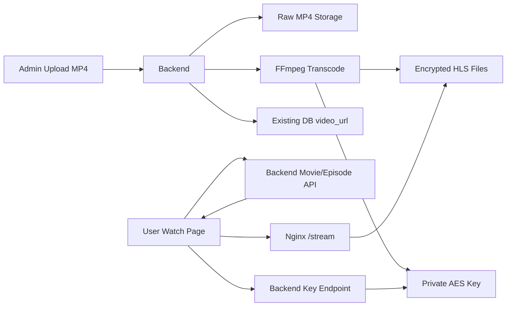
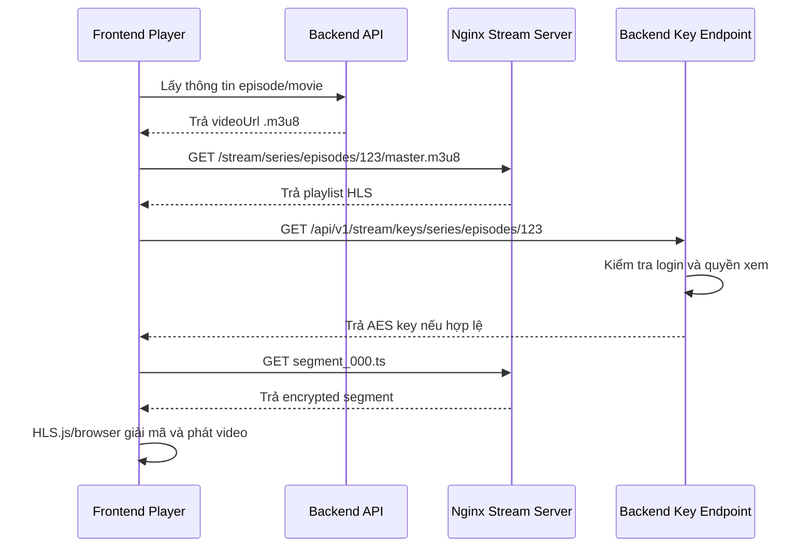

# Secure Video Streaming Flow

## Mục tiêu

Tài liệu này mô tả hướng triển khai phát video bảo mật cho movie platform bằng HLS mã hoá AES-128.

Mục tiêu chính:

- Chuyển video gốc `.mp4` sang HLS.
- Mã hoá các HLS segment bằng AES-128.
- Không tạo thêm bảng database mới.
- Tận dụng các field hiện có trong database.
- Lưu dữ liệu media trên server giả lập bằng Nginx tại `F:/movie-storage`.
- Chỉ user có quyền mới lấy được key giải mã video.

## Kết luận ngắn gọn

Frontend vẫn cần xử lý HLS, nhưng frontend không tự giải mã thủ công.

Trình phát video hoạt động như sau:

1. Frontend lấy `videoUrl` từ backend như hiện tại.
2. Nếu `videoUrl` là `.m3u8`, frontend dùng HLS.js để phát.
3. HLS.js đọc playlist HLS.
4. Playlist chứa `#EXT-X-KEY` trỏ về backend key endpoint.
5. HLS.js gọi endpoint lấy key.
6. Backend kiểm tra quyền xem phim.
7. Nếu hợp lệ, backend trả AES key.
8. Browser/HLS.js dùng key đó để giải mã segment và phát video.

Frontend không giữ secret key cố định. Key được xin từ backend theo từng nội dung.

## Kiến trúc tổng quan



## Không tạo thêm bảng database

Thiết kế này không dùng bảng mới như `media_assets` hoặc `media_encryption_keys`.

Thay vào đó, hệ thống dùng các field hiện có:

| Nội dung | Field hiện có | Giá trị sau xử lý |
|---|---|---|
| Tập phim | `episodes.video_url` | URL playlist `.m3u8` |
| Quảng cáo | `advertisements.video_url` | URL playlist `.m3u8` |
| Poster phim | `movies.poster_url` | URL ảnh qua Nginx |
| Backdrop phim | `movies.backdrop_url` | URL ảnh qua Nginx |

Ví dụ:

```text
episodes.video_url = http://localhost/stream/series/episodes/123/master.m3u8
advertisements.video_url = http://localhost/stream/ads/advertisements/45/master.m3u8
```

## Cấu hình storage

Backend dùng cấu hình sau trong `application.properties`:

```properties
app.storage.media.public-base-url=${MEDIA_PUBLIC_BASE_URL:http://localhost}
app.storage.media.movies-data-directory=${MEDIA_MOVIES_DATA_DIRECTORY:F:/movie-storage/data/movies}
app.storage.media.series-data-directory=${MEDIA_SERIES_DATA_DIRECTORY:F:/movie-storage/data/series}
app.storage.media.ads-data-directory=${MEDIA_ADS_DATA_DIRECTORY:F:/movie-storage/data/ads}
app.storage.media.others-data-directory=${MEDIA_OTHERS_DATA_DIRECTORY:F:/movie-storage/data/others}
app.storage.media.hls-directory=${MEDIA_HLS_DIRECTORY:F:/movie-storage/hls}
app.storage.media.keys-directory=${MEDIA_KEYS_DIRECTORY:F:/movie-storage/keys}
app.storage.media.max-upload-bytes=${MEDIA_MAX_UPLOAD_BYTES:5368709120}
app.storage.media.ffmpeg-path=${FFMPEG_PATH:ffmpeg}
```

Ý nghĩa:

| Config | Mục đích |
|---|---|
| `public-base-url` | Base URL public của Nginx |
| `series-data-directory` | Nơi lưu MP4 gốc cho episode |
| `ads-data-directory` | Nơi lưu MP4 gốc cho quảng cáo |
| `hls-directory` | Nơi xuất HLS encrypted để Nginx serve |
| `keys-directory` | Nơi lưu AES key riêng tư |
| `ffmpeg-path` | Đường dẫn FFmpeg |

## Mapping với Nginx hiện tại

Nginx đang expose:

```nginx
location /stream/ {
    alias F:/movie-storage/hls/;
}
```

Vì vậy file:

```text
F:/movie-storage/hls/series/episodes/123/master.m3u8
```

sẽ được truy cập qua URL:

```text
http://localhost/stream/series/episodes/123/master.m3u8
```

File segment:

```text
F:/movie-storage/hls/series/episodes/123/segment_000.ts
```

sẽ được truy cập qua URL:

```text
http://localhost/stream/series/episodes/123/segment_000.ts
```

## Quy tắc bảo mật storage

Key không được nằm trong thư mục public của Nginx.

Không lưu key tại:

```text
F:/movie-storage/hls
F:/movie-storage/data
F:/movie-storage/avatars
```

Key phải nằm tại:

```text
F:/movie-storage/keys
```

Nginx không được có `location` expose thư mục này.

Đúng:

```text
F:/movie-storage/keys/series/episodes/123/video.key
```

Sai:

```text
F:/movie-storage/hls/series/episodes/123/video.key
```

## Flow upload video

### Bước 1: Admin upload MP4

Endpoint backend:

```http
POST /api/v1/admin/media/episodes/{episodeId}/source
Content-Type: multipart/form-data
```

hoặc:

```http
POST /api/v1/admin/media/advertisements/{advertisementId}/source
Content-Type: multipart/form-data
```

Backend kiểm tra:

- User có role `ADMIN`.
- File không rỗng.
- File không vượt quá giới hạn dung lượng.
- MIME type là `video/mp4` hoặc `application/mp4`.
- Tên file kết thúc bằng `.mp4`.
- Header file có MP4 signature hợp lệ.

### Bước 2: Backend lưu MP4 gốc

Episode source:

```text
F:/movie-storage/data/series/episodes/{episodeId}/source.mp4
```

Advertisement source:

```text
F:/movie-storage/data/ads/advertisements/{advertisementId}/source.mp4
```

### Bước 3: Backend cập nhật URL phát

Backend cập nhật field sẵn có trong DB.

Episode:

```text
episodes.video_url = http://localhost/stream/series/episodes/{episodeId}/master.m3u8
```

Advertisement:

```text
advertisements.video_url = http://localhost/stream/ads/advertisements/{advertisementId}/master.m3u8
```

Ở giai đoạn hiện tại, URL này trỏ tới playlist tương lai sau khi transcode hoàn tất.

## Flow mã hoá video

### Bước 1: Sinh AES key

Backend sinh key AES-128 dài 16 bytes.

Ví dụ file key:

```text
F:/movie-storage/keys/series/episodes/123/video.key
```

Backend cũng sinh IV dạng hex 16 bytes.

Ví dụ:

```text
9f2c1a6d8e4b7c3f0011223344556677
```

### Bước 2: Tạo file key info cho FFmpeg

FFmpeg cần file `key_info` gồm 3 dòng:

```text
http://localhost:8080/api/v1/stream/keys/series/episodes/123
F:/movie-storage/keys/series/episodes/123/video.key
9f2c1a6d8e4b7c3f0011223344556677
```

Ý nghĩa:

| Dòng | Ý nghĩa |
|---|---|
| Dòng 1 | URI ghi vào playlist HLS |
| Dòng 2 | File key thật trên máy backend |
| Dòng 3 | IV dùng để mã hoá segment |

Dòng 1 phải trỏ về backend, không trỏ trực tiếp tới file key qua Nginx.

### Bước 3: Chạy FFmpeg

Ví dụ command cho episode:

```bash
ffmpeg -y \
  -i F:/movie-storage/data/series/episodes/123/source.mp4 \
  -c:v h264 \
  -c:a aac \
  -hls_time 6 \
  -hls_playlist_type vod \
  -hls_key_info_file F:/movie-storage/keys/series/episodes/123/key_info.txt \
  -hls_segment_filename F:/movie-storage/hls/series/episodes/123/segment_%03d.ts \
  F:/movie-storage/hls/series/episodes/123/master.m3u8
```

Output:

```text
F:/movie-storage/hls/series/episodes/123/master.m3u8
F:/movie-storage/hls/series/episodes/123/segment_000.ts
F:/movie-storage/hls/series/episodes/123/segment_001.ts
F:/movie-storage/hls/series/episodes/123/segment_002.ts
```

## Playlist sau khi mã hoá

Playlist sẽ có dạng:

```m3u8
#EXTM3U
#EXT-X-VERSION:3
#EXT-X-TARGETDURATION:6
#EXT-X-MEDIA-SEQUENCE:0
#EXT-X-PLAYLIST-TYPE:VOD
#EXT-X-KEY:METHOD=AES-128,URI="http://localhost:8080/api/v1/stream/keys/series/episodes/123",IV=0x9f2c1a6d8e4b7c3f0011223344556677
#EXTINF:6.000000,
segment_000.ts
#EXTINF:6.000000,
segment_001.ts
#EXTINF:6.000000,
segment_002.ts
#EXT-X-ENDLIST
```

Các `.ts` segment đã bị mã hoá. Nếu tải segment trực tiếp mà không có key thì không phát được đúng nội dung.

## Flow giải mã khi user xem phim



## Backend key endpoint

Endpoint dự kiến:

```http
GET /api/v1/stream/keys/series/episodes/{episodeId}
```

hoặc:

```http
GET /api/v1/stream/keys/ads/advertisements/{advertisementId}
```

Backend phải kiểm tra:

- User đã đăng nhập hay chưa.
- Episode có tồn tại hay không.
- Movie có active/published hay không.
- Episode có phải free preview không.
- User có gói subscription hợp lệ không nếu phim yêu cầu trả phí.
- User có bị giới hạn thiết bị/session không nếu hệ thống áp dụng.

Nếu hợp lệ:

```http
200 OK
Content-Type: application/octet-stream
Cache-Control: no-store
```

Body là 16 bytes AES key.

Nếu không hợp lệ:

```http
401 Unauthorized
```

hoặc:

```http
403 Forbidden
```

## Frontend cần làm gì

Frontend có cần làm, nhưng không cần tự viết thuật toán giải mã.

Frontend cần đảm bảo:

1. Nhận `videoUrl` từ backend.
2. Nếu URL là `.m3u8`, dùng HLS.js để load.
3. Nếu browser hỗ trợ native HLS, có thể gán trực tiếp `video.src`.
4. Khi HLS.js gọi key endpoint, request phải gửi kèm auth token/cookie.
5. Xử lý lỗi key endpoint trả `401` hoặc `403`.
6. Không hardcode link MP4 cũ nếu backend đã trả HLS.

Ví dụ logic frontend:

```ts
if (videoUrl.endsWith('.m3u8')) {
  if (Hls.isSupported()) {
    const hls = new Hls({
      xhrSetup: (xhr) => {
        const token = localStorage.getItem('accessToken');
        if (token) {
          xhr.setRequestHeader('Authorization', `Bearer ${token}`);
        }
      },
    });

    hls.loadSource(videoUrl);
    hls.attachMedia(videoElement);
  } else if (videoElement.canPlayType('application/vnd.apple.mpegurl')) {
    videoElement.src = videoUrl;
  }
} else {
  videoElement.src = videoUrl;
}
```

Nếu hệ thống đang dùng cookie auth thay vì bearer token, HLS.js cần bật credential phù hợp:

```ts
const hls = new Hls({
  xhrSetup: (xhr) => {
    xhr.withCredentials = true;
  },
});
```

## Khác biệt giữa MP4 thường và HLS mã hoá

| Tiêu chí | MP4 thường | HLS AES-128 |
|---|---|---|
| File phát | Một file `.mp4` | Playlist `.m3u8` và nhiều segment `.ts` |
| Bảo vệ nội dung | Yếu | Tốt hơn MP4 public |
| Key giải mã | Không có | Do backend cấp sau khi check quyền |
| Seek video | Browser xử lý trực tiếp | HLS xử lý theo segment |
| Phù hợp streaming | Trung bình | Tốt |
| Chặn tải lậu tuyệt đối | Không | Không |

## Giới hạn của soft-DRM

AES-128 HLS là soft-DRM, không phải DRM cấp Widevine/FairPlay/PlayReady.

Nó giúp:

- Không để lộ MP4 gốc công khai.
- Không phát được segment nếu thiếu key.
- Backend kiểm soát quyền lấy key.
- Dễ triển khai với FFmpeg, Nginx, HLS.js.

Nó không thể chống tuyệt đối:

- User quay màn hình.
- User có quyền xem rồi trích xuất key từ runtime.
- Extension/browser devtools của user nâng cao.
- Chia sẻ token đăng nhập nếu hệ thống không giới hạn session.

Để mạnh hơn cần DRM thật như Widevine/FairPlay/PlayReady.

## CORS và header cần chú ý

Nginx hiện có:

```nginx
add_header Access-Control-Allow-Origin *;
```

Điều này ổn cho public playlist/segment, nhưng không nên dùng cho backend key endpoint nếu có credential.

Backend key endpoint nên cấu hình CORS chặt hơn:

```text
Access-Control-Allow-Origin: http://localhost:3000
Access-Control-Allow-Credentials: true
Cache-Control: no-store
```

Không nên cache key ở browser hoặc proxy.

## Trạng thái hiện tại

Đã hoàn thành:

- Bỏ hướng tạo bảng `media_assets` và `media_encryption_keys`.
- Dùng lại DB hiện tại.
- Cấu hình backend theo `F:/movie-storage`.
- Thêm upload endpoint cho episode và advertisement.
- Upload MP4 vào đúng folder Nginx giả lập.
- Update `video_url` sang URL HLS tương lai.

Chưa hoàn thành:

- Chạy FFmpeg thật để tạo encrypted HLS.
- Sinh AES key và IV.
- Tạo key endpoint có check quyền.
- Sửa frontend để đảm bảo HLS.js gửi auth header/cookie khi lấy key.
- Admin UI upload video.

## Flow triển khai tiếp theo

### Phase 1: Backend transcode

- Sinh key AES-128.
- Sinh IV.
- Tạo `key_info.txt`.
- Chạy FFmpeg.
- Xuất HLS vào `F:/movie-storage/hls`.
- Giữ key ở `F:/movie-storage/keys`.

### Phase 2: Backend key endpoint

- Tạo endpoint trả key.
- Kiểm tra quyền xem episode.
- Trả `403` nếu user không có quyền.
- Trả key bytes nếu user hợp lệ.

### Phase 3: Frontend player

- Detect `.m3u8`.
- Dùng HLS.js.
- Gửi auth khi request key.
- Hiển thị lỗi rõ nếu key bị từ chối.

### Phase 4: Admin UI

- Thêm upload video cho episode.
- Thêm upload video cho advertisement.
- Hiển thị trạng thái xử lý.
- Cho admin preview playlist sau khi transcode xong.

## Quy tắc quan trọng

- Không commit AES key vào Git.
- Không expose `F:/movie-storage/keys` qua Nginx.
- Không ghi key URI trong playlist là file public.
- Không hardcode key ở frontend.
- Không dùng URL MP4 public cho phim cần bảo vệ.
- Không cache key response.
- Backend luôn là nơi quyết định user có quyền lấy key hay không.
