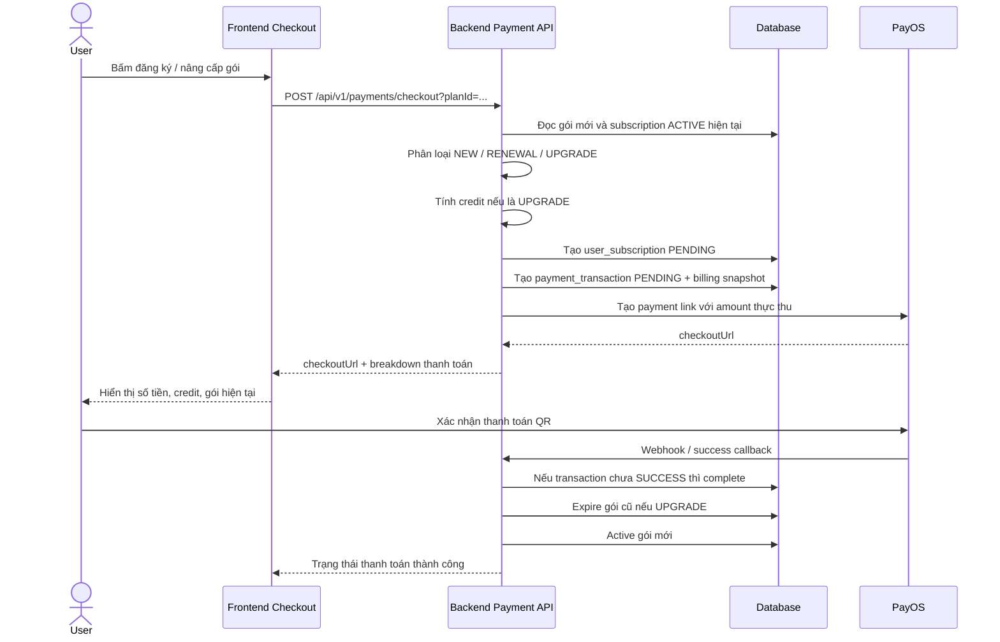

# Luồng thanh toán thuê bao và nâng cấp có bù trừ

**Cập nhật:** 29/04/2026  
**Phạm vi:** Backend `movie-streaming-api`, PayOS checkout, subscription lifecycle  
**Trạng thái:** Đang dùng mô hình không đổi schema, lưu audit bằng snapshot JSON trong bảng hiện có

---

## 1. Mục tiêu nghiệp vụ

Hệ thống thuê bao của nền tảng xem phim cần xử lý các trường hợp sau:

1. Người dùng chưa có gói trả phí và đăng ký gói mới.
2. Người dùng đang có gói còn hạn và gia hạn đúng gói đó.
3. Người dùng đang có gói còn hạn và nâng cấp lên gói đắt hơn.
4. Người dùng hủy thanh toán tại PayOS hoặc thanh toán thất bại.
5. PayOS gửi callback/webhook nhiều lần nhưng hệ thống không được kích hoạt trùng.

Đối với nâng cấp gói, hệ thống áp dụng mô hình **proration / bù trừ theo thời gian còn lại**:

> Người dùng được trừ lại phần giá trị chưa sử dụng của gói hiện tại, sau đó chỉ thanh toán phần chênh lệch thực tế để lên gói mới.

Ví dụ: đang dùng gói 7.000đ/7 ngày, còn 3 ngày, nâng lên gói 29.000đ.  
Credit xấp xỉ: `7.000 / 7 * 3 = 3.000đ`.  
Số tiền cần thanh toán: `29.000 - 3.000 = 26.000đ`.

---

## 2. Bảng dữ liệu liên quan

Luồng hiện tại tận dụng các bảng đã có trong `DB-full.txt`, không cần tạo bảng mới.

### 2.1. `subscription_plans`

Lưu cấu hình gói bán ra:

- `id`
- `name`
- `code`
- `price`
- `duration_days`
- `max_devices`
- `video_quality`
- `has_ads_free`
- `is_active`

Các trường này đủ để:

- xác định giá gói;
- xác định thời hạn gói;
- xác định quyền lợi xem phim;
- so sánh gói hiện tại với gói mới khi nâng cấp.

### 2.2. `user_subscriptions`

Lưu trạng thái thuê bao của người dùng:

- `user_id`
- `plan_id`
- `start_at`
- `end_at`
- `status`
- `auto_renew`

Các trạng thái chính đang dùng:

- `PENDING`: đã tạo phiên thanh toán, chưa thanh toán thành công.
- `ACTIVE`: gói đang có hiệu lực.
- `EXPIRED`: gói đã hết hiệu lực hoặc bị thay thế khi nâng cấp.

### 2.3. `payment_transactions`

Lưu giao dịch thanh toán:

- `user_id`
- `subscription_id`
- `amount`
- `currency`
- `payment_method`
- `status`
- `provider_transaction_id`
- `provider_response`
- `paid_at`

Trường `provider_response` được dùng để lưu snapshot audit dạng JSON, gồm:

- loại billing: `NEW`, `RENEWAL`, `UPGRADE`;
- gói cũ;
- gói mới;
- subscription cũ;
- giá gói mới;
- credit được trừ;
- số tiền thực thu;
- số ngày còn lại;
- phản hồi PayOS sau khi thanh toán.

---

## 3. Luồng tổng quan



---

## 4. Phân loại billing

Logic nằm trong `PaymentService.calculateBilling`.

### 4.1. `NEW`

Điều kiện:

- người dùng không có subscription `ACTIVE`; hoặc
- subscription `ACTIVE` đã hết hạn.

Kết quả:

- `originalAmount = price(gói mới)`;
- `creditAmount = 0`;
- `chargedAmount = originalAmount`;
- tạo subscription mới ở trạng thái `PENDING`;
- sau thanh toán thành công, subscription chuyển sang `ACTIVE`.

### 4.2. `RENEWAL`

Điều kiện:

- người dùng đang có subscription `ACTIVE` còn hạn;
- gói mới trùng với gói hiện tại.

Kết quả hiện tại:

- coi như mua lại/gia hạn cùng gói;
- không áp dụng credit;
- không expire subscription cũ trong metadata upgrade;
- sau thanh toán thành công, subscription mới được active theo duration của gói.

> Lưu ý nghiệp vụ: nếu muốn gia hạn nối tiếp từ ngày hết hạn cũ thay vì tính từ thời điểm thanh toán, cần mở rộng logic `completePayment` riêng cho `RENEWAL`.

### 4.3. `UPGRADE`

Điều kiện:

- người dùng đang có subscription `ACTIVE` còn hạn;
- gói mới khác gói hiện tại;
- giá gói mới lớn hơn giá gói hiện tại.

Kết quả:

- tính credit theo phần thời gian còn lại của gói cũ;
- trừ credit vào giá gói mới;
- lưu `previousSubscriptionId` vào snapshot;
- sau thanh toán thành công, subscription cũ bị chuyển sang `EXPIRED`, subscription mới chuyển sang `ACTIVE`.

### 4.4. Downgrade / hạ gói

Điều kiện:

- người dùng đang có gói `ACTIVE`;
- chọn gói có giá thấp hơn hoặc bằng gói hiện tại nhưng không phải cùng gói.

Kết quả hiện tại:

- backend từ chối bằng `BAD_REQUEST`.

Lý do:

- chưa có chính sách hoàn tiền;
- chưa có bảng ledger/credit wallet;
- tránh tạo trạng thái khó hiểu khi người dùng đã trả tiền cho gói cao hơn.

Khuyến nghị nghiệp vụ sau này:

- cho phép đặt lịch downgrade ở cuối kỳ hiện tại; hoặc
- cho phép downgrade ngay nhưng không hoàn tiền; hoặc
- thêm credit wallet nếu cần hoàn tiền nội bộ.

---

## 5. Công thức bù trừ nâng cấp

### 5.1. Công thức

```text
remainingSeconds = seconds_between(now, currentSubscription.endAt)
totalSeconds = currentPlan.durationDays * 24 * 60 * 60
creditAmount = floor(currentPlan.price * remainingSeconds / totalSeconds)
chargedAmount = max(0, newPlan.price - creditAmount)
```

Trong code:

- dùng `BigDecimal` để tránh sai số số học;
- chia với `RoundingMode.DOWN` để không trừ quá số tiền còn lại;
- `chargedAmount` không nhỏ hơn 0.

### 5.2. Vì sao tính theo giây thay vì theo ngày?

Tính theo giây công bằng hơn vì người dùng có thể nâng cấp vào bất kỳ thời điểm nào trong ngày.

Ví dụ:

- Gói hiện tại: 7.000đ / 7 ngày.
- Còn lại: 3 ngày 12 giờ.
- Credit theo ngày làm tròn có thể sai lệch.
- Credit theo giây phản ánh chính xác phần chưa sử dụng.

### 5.3. Hiển thị cho người dùng

Frontend có thể hiển thị `remainingDays` dạng làm tròn lên để dễ hiểu:

```text
Tín dụng còn lại (4 ngày): -3.500đ
Cần thanh toán: 25.500đ
```

Trong khi backend vẫn tính tiền bằng giây để đảm bảo chính xác.

---

## 6. Snapshot audit trong `provider_response`

Khi tạo checkout, backend lưu snapshot trước khi gọi PayOS.

Ví dụ `NEW`:

```json
{
  "billingType": "NEW",
  "previousSubscriptionId": null,
  "previousPlanId": null,
  "newPlanId": 2,
  "originalAmount": 29000,
  "creditAmount": 0,
  "chargedAmount": 29000,
  "remainingDays": 0,
  "currentPlanName": ""
}
```

Ví dụ `UPGRADE`:

```json
{
  "billingType": "UPGRADE",
  "previousSubscriptionId": 15,
  "previousPlanId": 1,
  "newPlanId": 2,
  "originalAmount": 29000,
  "creditAmount": 3000,
  "chargedAmount": 26000,
  "remainingDays": 3,
  "currentPlanName": "Basic"
}
```

Sau khi PayOS callback/webhook thành công, backend nối thêm phản hồi PayOS:

```text
{billing snapshot json}
---PAYOS_RESPONSE---
{payos response json}
```

Mục đích:

- truy vết được vì sao user trả số tiền đó;
- biết subscription cũ nào đã bị thay thế;
- hỗ trợ debug webhook/callback;
- không cần thêm bảng mới.

---

## 7. Idempotency khi thanh toán thành công

Logic nằm trong `PaymentService.completePayment`.

Quy tắc:

1. Tìm transaction theo `providerTransactionId`.
2. Nếu transaction đã `SUCCESS`, return ngay.
3. Nếu chưa `SUCCESS`:
   - set `status = SUCCESS`;
   - set `paidAt = now`;
   - merge provider response;
   - nếu snapshot có `previousSubscriptionId`, expire subscription cũ;
   - active subscription mới.

Điều này giúp an toàn khi:

- PayOS gửi webhook nhiều lần;
- frontend success page gọi API success nhiều lần;
- người dùng refresh trang success;
- callback và webhook cùng đến gần nhau.

---

## 8. Luồng hủy/thất bại thanh toán

### 8.1. Người dùng bấm hủy ở PayOS

PayOS redirect về cancel URL, ví dụ:

```text
/subscription/cancel?code=00&id=...&cancel=true&status=CANCELLED&orderCode=...
```

Frontend nên có route `/subscription/cancel` để:

- hiển thị thông báo thanh toán đã hủy;
- cho phép quay lại `/pricing`;
- cho phép tạo checkout mới nếu user muốn thử lại.

### 8.2. Backend failure

`PaymentService.failPayment` hiện có thể set transaction `FAILED`, nhưng luồng PayOS cancel chủ yếu được xử lý qua redirect/callback.

Khuyến nghị:

- nếu có webhook trạng thái failed/cancel rõ ràng từ PayOS, gọi `failPayment`;
- nếu chỉ là user hủy trên frontend, không nên active subscription;
- các subscription `PENDING` cũ có thể được dọn bằng job định kỳ sau một thời gian.

---

## 9. Tự động gia hạn

Hiện tại hệ thống đặt:

```text
autoRenew = false
```

Lý do:

- PayOS QR/chuyển khoản không phải cơ chế subscription recurring tự động;
- không có mandate lưu phương thức thanh toán định kỳ;
- tự động trừ tiền không phù hợp nếu chỉ dùng QR chuyển khoản.

Cách hợp lý hiện tại:

- gọi là **gia hạn thủ công**;
- trước khi hết hạn, frontend/backend có thể nhắc người dùng gia hạn;
- người dùng bấm gia hạn và thanh toán QR lại.

Nếu sau này muốn auto-renew thật sự, cần:

- cổng thanh toán hỗ trợ recurring/tokenized payment;
- điều khoản đồng ý gia hạn;
- job định kỳ tạo invoice/payment;
- retry/failure policy;
- email/thông báo trước khi trừ tiền.

---

## 10. Ảnh hưởng của thuê bao lên quyền xem phim

Sau khi thanh toán thành công:

1. `payment_transactions.status` chuyển `SUCCESS`.
2. `user_subscriptions.status` của gói mới chuyển `ACTIVE`.
3. Các API kiểm tra quyền người dùng nên dựa vào subscription `ACTIVE` còn hạn.
4. Quyền lợi lấy từ `subscription_plans`, ví dụ:
   - `has_ads_free`: có/không quảng cáo;
   - `video_quality`: chất lượng tối đa;
   - `max_devices`: số thiết bị tối đa;
   - `duration_days`: thời hạn.

Điều kiện active hợp lệ nên là:

```text
user_id = current user
status = ACTIVE
end_at > now
```

Nếu không có subscription active hợp lệ, user được xem theo quyền Free/basic mặc định.

---

## 11. API chính

### 11.1. Tạo checkout

```http
POST /api/v1/payments/checkout?planId={planId}
Authorization: Bearer {token}
```

Response có các trường quan trọng:

```json
{
  "paymentId": 10,
  "orderCode": "ORDER_1_1712973999999",
  "checkoutUrl": "https://pay.payos.vn/...",
  "amount": 26000,
  "planName": "Premium",
  "billingType": "UPGRADE",
  "originalAmount": 29000,
  "creditAmount": 3000,
  "chargedAmount": 26000,
  "remainingDays": 3,
  "currentPlanName": "Basic",
  "newPlanName": "Premium"
}
```

Frontend dùng response này để hiển thị breakdown trước khi mở PayOS.

### 11.2. Webhook PayOS

```http
POST /api/v1/webhooks/payment
```

Backend verify webhook bằng PayOS SDK, sau đó gọi:

```java
paymentService.completePayment(orderCode, transactionId, providerResponse)
```

### 11.3. Success callback

```http
GET /api/v1/payments/success?orderCode=...&code=00&status=PAID
```

Dùng khi frontend success page muốn xác nhận lại giao dịch.

---

## 12. Điểm cần đặc biệt chú ý

### 12.1. `orderCode` của PayOS là dạng số

Khi tạo payment link, backend tạo mã nội bộ dạng:

```text
ORDER_{userId}_{timestamp}
```

Sau đó lấy numeric value để gửi PayOS:

```text
numericOrderCode = orderCode.replaceAll("\\D", "")
```

PayOS callback/webhook thường trả `orderCode` dạng số.

Vì vậy, `payment_transactions.provider_transaction_id` phải lưu đúng giá trị numeric để callback/webhook tìm được transaction.

### 12.2. Không dùng `orderCode` hiển thị để tra PayOS nếu đã lưu numeric

Nếu frontend hoặc tài liệu hiển thị `ORDER_...`, cần phân biệt:

- `orderCode` thân thiện nội bộ: `ORDER_1_...`;
- `providerTransactionId` dùng với PayOS: chuỗi số.

Khuyến nghị kỹ thuật:

- hoặc response frontend nên trả thêm `providerOrderCode`;
- hoặc backend nên normalize order code trong các endpoint success/get;
- hoặc thống nhất chỉ trả numeric order code cho luồng PayOS.

Nếu không thống nhất, có thể gặp lỗi `PAYMENT_TRANSACTION_NOT_FOUND` sau khi PayOS redirect.

---

## 13. Checklist kiểm thử

### 13.1. Đăng ký mới

- [ ] User chưa có subscription active.
- [ ] Bấm đăng ký gói.
- [ ] Checkout hiển thị `Đăng ký mới`.
- [ ] `creditAmount = 0`.
- [ ] Thanh toán thành công.
- [ ] Transaction chuyển `SUCCESS`.
- [ ] Subscription chuyển `ACTIVE`.

### 13.2. Nâng cấp gói

- [ ] User đang có gói thấp hơn còn hạn.
- [ ] Bấm nâng cấp gói cao hơn.
- [ ] Checkout hiển thị `Nâng cấp có bù trừ`.
- [ ] Có dòng credit âm.
- [ ] `chargedAmount = newPlan.price - creditAmount`.
- [ ] Thanh toán thành công.
- [ ] Subscription cũ chuyển `EXPIRED`.
- [ ] Subscription mới chuyển `ACTIVE`.
- [ ] Snapshot lưu `previousSubscriptionId`.

### 13.3. Hạ gói

- [ ] User đang có gói cao hơn còn hạn.
- [ ] Chọn gói thấp hơn.
- [ ] Backend từ chối bằng `BAD_REQUEST`.
- [ ] Frontend hiển thị thông báo rõ ràng.

### 13.4. Hủy PayOS

- [ ] User mở PayOS.
- [ ] Bấm hủy.
- [ ] PayOS redirect về `/subscription/cancel`.
- [ ] Không có subscription nào được active.
- [ ] User có thể quay lại bảng giá.

### 13.5. Idempotency

- [ ] Gọi success callback 2 lần cùng `orderCode`.
- [ ] Webhook gửi lại cùng `orderCode`.
- [ ] Transaction vẫn chỉ `SUCCESS` một lần.
- [ ] Không tạo thêm subscription active trùng.
- [ ] Subscription cũ không bị xử lý sai.

---

## 14. Kết luận

Thiết kế hiện tại phù hợp với yêu cầu không tạo thêm bảng:

- dùng `user_subscriptions` để quản lý vòng đời gói;
- dùng `payment_transactions` để quản lý thanh toán;
- dùng `provider_response` làm audit snapshot;
- dùng PayOS cho thanh toán QR thủ công;
- dùng proration để nâng cấp công bằng theo thời gian còn lại.

Điểm quan trọng nhất cần giữ ổn định là **mapping `orderCode` giữa PayOS và transaction nội bộ**. Nếu mapping này đúng, luồng thanh toán, nâng cấp, callback/webhook và kích hoạt quyền thuê bao có thể vận hành nhất quán trên schema hiện tại.
