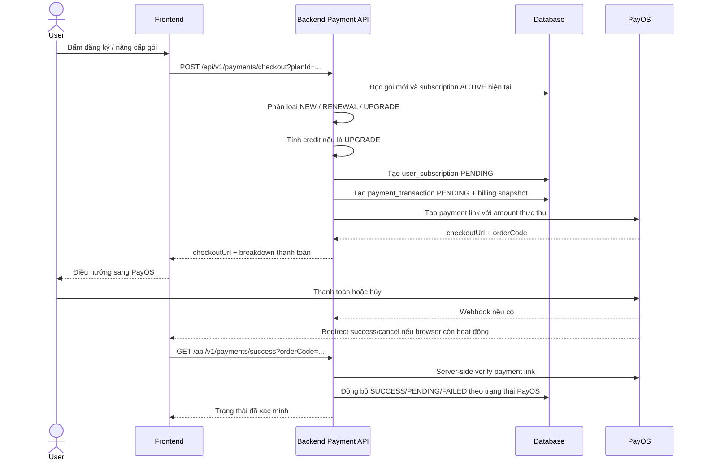

# Luồng thanh toán thuê bao, PayOS và đối soát giao dịch

**Cập nhật:** 01/05/2026  
**Phạm vi:** Backend `movie-streaming-api`, frontend `movie-streaming-web`, PayOS checkout, webhook, success redirect, đối soát giao dịch pending  
**Trạng thái:** Đang dùng mô hình không đổi schema, lấy backend làm nguồn sự thật, xác minh PayOS ở server và lưu audit bằng snapshot JSON trong bảng hiện có

---

## 1. Mục tiêu nghiệp vụ

Hệ thống thuê bao của nền tảng xem phim cần xử lý chính xác các trường hợp sau:

1. Người dùng chưa có gói trả phí và đăng ký gói mới.
2. Người dùng đang có gói còn hạn và gia hạn đúng gói đó.
3. Người dùng đang có gói còn hạn và nâng cấp lên gói đắt hơn.
4. Người dùng mở PayOS nhưng chưa thanh toán, thanh toán chậm hoặc đóng trang giữa chừng.
5. Người dùng đã thanh toán nhưng PayOS redirect về frontend bị mất do lỗi mạng, browser hoặc frontend bị tắt.
6. Người dùng đã thanh toán nhưng backend tạm thời chết nên chưa xử lý được redirect hoặc webhook.
7. PayOS tạm thời lỗi, trả trạng thái chưa cuối cùng hoặc webhook đến muộn.
8. PayOS gửi webhook nhiều lần nhưng hệ thống không được kích hoạt trùng.
9. Frontend bị sửa query string thủ công nhưng hệ thống không được tin dữ liệu từ client.
10. Người dùng cần có nơi để xem lại giao dịch đang chờ và tự bấm kiểm tra lại khi cần.

Đối với nâng cấp gói, hệ thống áp dụng mô hình **proration / bù trừ theo thời gian còn lại**:

> Người dùng được trừ lại phần giá trị chưa sử dụng của gói hiện tại, sau đó chỉ thanh toán phần chênh lệch thực tế để lên gói mới.

Ví dụ: đang dùng gói 7.000đ/7 ngày, còn 3 ngày, nâng lên gói 29.000đ.  
Credit xấp xỉ: `7.000 / 7 * 3 = 3.000đ`.  
Số tiền cần thanh toán: `29.000 - 3.000 = 26.000đ`.

---

## 2. Nguyên tắc thiết kế bắt buộc

### 2.1. Backend là nguồn sự thật

Frontend không được quyết định giao dịch thành công chỉ dựa vào URL PayOS trả về.

Các tham số như sau chỉ dùng để điều hướng hoặc hiển thị tạm thời, không được dùng làm bằng chứng thanh toán:

```text
code
id
cancel
status
```

Lý do:

- query string có thể bị người dùng sửa thủ công;
- browser có thể refresh hoặc replay URL cũ;
- PayOS redirect có thể đến trước webhook;
- callback từ client không đảm bảo xác thực bằng chữ ký webhook.

Luồng đúng là:

1. Frontend lấy `orderCode` từ URL.
2. Frontend gọi backend endpoint xác minh.
3. Backend gọi PayOS SDK/API để lấy trạng thái thật của payment link.
4. Backend đồng bộ database nếu PayOS xác nhận đã thanh toán.
5. Frontend chỉ hiển thị trạng thái dựa trên response của backend.

### 2.2. Không hard-code backend URL ở frontend

Frontend phải gọi API qua service layer và `apiClient`, base URL lấy từ biến môi trường:

```text
NEXT_PUBLIC_API_BASE_URL=http://localhost:8080/api/v1
```

Không viết trực tiếp dạng sau trong component:

```typescript
fetch("http://localhost:8080/api/v1/...")
```

Lý do:

- khác môi trường local, staging, production;
- dễ lỗi khi đổi domain API;
- khó test và khó bảo trì;
- phá vỡ cấu trúc module API hiện có.

### 2.3. Idempotency là bắt buộc

Cùng một giao dịch có thể được xử lý từ nhiều nguồn:

- PayOS webhook;
- success redirect;
- người dùng bấm kiểm tra lại;
- job đối soát định kỳ;
- backend restart và scheduler chạy lại.

Vì vậy backend phải đảm bảo:

- nếu transaction đã `SUCCESS`, gọi lại không được active thêm lần nữa;
- nếu subscription mới đã active, không được tạo thêm subscription khác;
- nếu subscription cũ đã `EXPIRED`, không được expire sai gói khác;
- provider response được merge/audit nhưng không làm thay đổi tiền đã tính ban đầu.

---

## 3. Bảng dữ liệu liên quan

Luồng hiện tại tận dụng các bảng đã có trong `DB-full.txt`, không cần tạo bảng mới.

### 3.1. `subscription_plans`

Lưu cấu hình gói bán ra:

- `id`
- `name`
- `code`
- `price`
- `duration_days`
- `max_devices`
- `video_quality`
- `has_ads_free`
- `is_active`

Các trường này đủ để:

- xác định giá gói;
- xác định thời hạn gói;
- xác định quyền lợi xem phim;
- so sánh gói hiện tại với gói mới khi nâng cấp.

### 3.2. `user_subscriptions`

Lưu trạng thái thuê bao của người dùng:

- `user_id`
- `plan_id`
- `start_at`
- `end_at`
- `status`
- `auto_renew`

Các trạng thái chính đang dùng:

| Trạng thái | Ý nghĩa |
| --- | --- |
| `PENDING` | Đã tạo phiên thanh toán, chưa xác nhận thanh toán thành công |
| `ACTIVE` | Gói đang có hiệu lực |
| `EXPIRED` | Gói đã hết hiệu lực hoặc bị thay thế khi nâng cấp |

### 3.3. `payment_transactions`

Lưu giao dịch thanh toán:

- `user_id`
- `subscription_id`
- `amount`
- `currency`
- `payment_method`
- `status`
- `provider_transaction_id`
- `provider_response`
- `paid_at`
- `created_at`

Các trạng thái chính đang dùng:

| Trạng thái | Ý nghĩa |
| --- | --- |
| `PENDING` | Đã tạo payment link, chưa xác nhận thanh toán thành công |
| `SUCCESS` | Đã xác nhận thanh toán thành công từ PayOS hoặc nguồn tin cậy phía server |
| `FAILED` | Thanh toán thất bại, bị hủy hoặc được backend đánh dấu thất bại |

`payment_transactions.provider_transaction_id` là mã dùng để tra cứu với PayOS. Với PayOS, mã này cần là `orderCode` dạng số.

### 3.4. Có cần tạo bảng mới không?

Hiện tại không bắt buộc tạo bảng mới vì các nhu cầu cốt lõi đã được đáp ứng:

| Nhu cầu | Bảng/trường đang đáp ứng |
| --- | --- |
| Biết user đang có gói nào | `user_subscriptions` |
| Biết giao dịch đang chờ hay thành công | `payment_transactions.status` |
| Biết số tiền thực thu | `payment_transactions.amount` |
| Biết mã PayOS để tra cứu lại | `payment_transactions.provider_transaction_id` |
| Audit proration | `payment_transactions.provider_response` |
| Audit thời điểm thanh toán | `payment_transactions.paid_at` |
| Tự động tìm giao dịch pending cũ | `payment_transactions.created_at` |

Chỉ nên cân nhắc bảng mới trong tương lai nếu cần:

- ledger kế toán chi tiết;
- refund một phần;
- credit wallet;
- invoice chuẩn thuế;
- lịch sử webhook raw đầy đủ;
- nhiều cổng thanh toán song song với retry policy phức tạp.

---

## 4. Luồng tổng quan



---

## 5. Tạo checkout

Endpoint:

```http
POST /api/v1/payments/checkout?planId={planId}
Authorization: Bearer {token}
```

Backend thực hiện:

1. Lấy user từ security context.
2. Kiểm tra gói có tồn tại và `is_active = true`.
3. Lấy subscription `ACTIVE` hiện tại nếu có.
4. Phân loại billing: `NEW`, `RENEWAL`, `UPGRADE`.
5. Tính số tiền phải thu.
6. Tạo subscription mới `PENDING`.
7. Tạo payment transaction `PENDING`.
8. Gọi PayOS tạo payment link.
9. Trả checkout URL và breakdown cho frontend.

Response có các trường quan trọng:

```json
{
  "paymentId": 10,
  "orderCode": "151777628551858",
  "checkoutUrl": "https://pay.payos.vn/...",
  "amount": 26000,
  "planName": "Premium",
  "billingType": "UPGRADE",
  "originalAmount": 29000,
  "creditAmount": 3000,
  "chargedAmount": 26000,
  "remainingDays": 3,
  "currentPlanName": "Basic",
  "newPlanName": "Premium"
}
```

Frontend dùng response này để hiển thị breakdown trước khi mở PayOS.

---

## 6. Phân loại billing

Logic nằm trong `PaymentService.calculateBilling`.

### 6.1. `NEW`

Điều kiện:

- người dùng không có subscription `ACTIVE`; hoặc
- subscription `ACTIVE` đã hết hạn.

Kết quả:

- `originalAmount = price(gói mới)`;
- `creditAmount = 0`;
- `chargedAmount = originalAmount`;
- tạo subscription mới ở trạng thái `PENDING`;
- sau thanh toán thành công, subscription chuyển sang `ACTIVE`.

### 6.2. `RENEWAL`

Điều kiện:

- người dùng đang có subscription `ACTIVE` còn hạn;
- gói mới trùng với gói hiện tại.

Kết quả hiện tại:

- coi như mua lại hoặc gia hạn cùng gói;
- không áp dụng credit;
- không expire subscription cũ theo metadata upgrade;
- sau thanh toán thành công, subscription mới được active theo duration của gói.

Lưu ý nghiệp vụ: nếu muốn gia hạn nối tiếp từ ngày hết hạn cũ thay vì tính từ thời điểm thanh toán, cần mở rộng logic `completePayment` riêng cho `RENEWAL`.

### 6.3. `UPGRADE`

Điều kiện:

- người dùng đang có subscription `ACTIVE` còn hạn;
- gói mới khác gói hiện tại;
- giá gói mới lớn hơn giá gói hiện tại.

Kết quả:

- tính credit theo phần thời gian còn lại của gói cũ;
- trừ credit vào giá gói mới;
- lưu `previousSubscriptionId` vào snapshot;
- sau thanh toán thành công, subscription cũ bị chuyển sang `EXPIRED`, subscription mới chuyển sang `ACTIVE`.

### 6.4. Downgrade / hạ gói

Điều kiện:

- người dùng đang có gói `ACTIVE`;
- chọn gói có giá thấp hơn hoặc bằng gói hiện tại nhưng không phải cùng gói.

Kết quả hiện tại:

- backend từ chối bằng `BAD_REQUEST`.

Lý do:

- chưa có chính sách hoàn tiền;
- chưa có bảng ledger/credit wallet;
- tránh tạo trạng thái khó hiểu khi người dùng đã trả tiền cho gói cao hơn.

Khuyến nghị nghiệp vụ sau này:

- cho phép đặt lịch downgrade ở cuối kỳ hiện tại; hoặc
- cho phép downgrade ngay nhưng không hoàn tiền; hoặc
- thêm credit wallet nếu cần hoàn tiền nội bộ.

---

## 7. Công thức bù trừ nâng cấp

### 7.1. Công thức

```text
remainingSeconds = seconds_between(now, currentSubscription.endAt)
totalSeconds = currentPlan.durationDays * 24 * 60 * 60
creditAmount = floor(currentPlan.price * remainingSeconds / totalSeconds)
chargedAmount = max(0, newPlan.price - creditAmount)
```

Trong code:

- dùng `BigDecimal` để tránh sai số số học;
- chia với `RoundingMode.DOWN` để không trừ quá số tiền còn lại;
- `chargedAmount` không nhỏ hơn 0.

### 7.2. Vì sao tính theo giây thay vì theo ngày?

Tính theo giây công bằng hơn vì người dùng có thể nâng cấp vào bất kỳ thời điểm nào trong ngày.

Ví dụ:

- Gói hiện tại: 7.000đ / 7 ngày.
- Còn lại: 3 ngày 12 giờ.
- Credit theo ngày làm tròn có thể sai lệch.
- Credit theo giây phản ánh chính xác phần chưa sử dụng.

### 7.3. Hiển thị cho người dùng

Frontend có thể hiển thị `remainingDays` dạng làm tròn lên để dễ hiểu:

```text
Tín dụng còn lại (4 ngày): -3.500đ
Cần thanh toán: 25.500đ
```

Backend vẫn tính tiền bằng giây để đảm bảo chính xác.

---

## 8. Snapshot audit trong `provider_response`

Khi tạo checkout, backend lưu snapshot trước khi gọi PayOS.

Ví dụ `NEW`:

```json
{
  "billingType": "NEW",
  "previousSubscriptionId": null,
  "previousPlanId": null,
  "newPlanId": 2,
  "originalAmount": 29000,
  "creditAmount": 0,
  "chargedAmount": 29000,
  "remainingDays": 0,
  "currentPlanName": ""
}
```

Ví dụ `UPGRADE`:

```json
{
  "billingType": "UPGRADE",
  "previousSubscriptionId": 15,
  "previousPlanId": 1,
  "newPlanId": 2,
  "originalAmount": 29000,
  "creditAmount": 3000,
  "chargedAmount": 26000,
  "remainingDays": 3,
  "currentPlanName": "Basic"
}
```

Sau khi backend xác minh với PayOS, response từ PayOS được nối thêm vào audit:

```text
{billing snapshot json}
---PAYOS_RESPONSE---
{payos response json}
```

Mục đích:

- truy vết được vì sao user trả số tiền đó;
- biết subscription cũ nào đã bị thay thế;
- hỗ trợ debug webhook/callback/scheduler;
- không cần thêm bảng mới.

---

## 9. Server-side verification trên trang success

### 9.1. Vấn đề cũ

Trước đây frontend success page đọc trực tiếp query string từ PayOS:

```text
/subscription/success?code=00&id=...&cancel=false&status=PAID&orderCode=...
```

Nếu frontend tin `status=PAID`, có các rủi ro:

- user có thể tự sửa URL thành `status=PAID`;
- trang success có thể hiển thị sai số tiền nếu không lấy dữ liệu thật từ backend;
- khi PayOS hoặc backend trả chậm, frontend không biết trạng thái thực;
- payment pending có thể bị hiển thị nhầm là thành công.

### 9.2. Luồng mới

Trang `/subscription/success` chỉ dùng `orderCode` để yêu cầu backend xác minh:

```http
GET /api/v1/payments/success?orderCode={orderCode}
```

Backend thực hiện:

1. Validate `orderCode` không rỗng.
2. Tìm `payment_transactions` theo `provider_transaction_id`.
3. Gọi PayOS SDK/API để lấy payment link thật.
4. Đọc trạng thái PayOS.
5. Nếu PayOS là `PAID`, gọi `completePayment`.
6. Nếu PayOS vẫn `PENDING`, giữ transaction `PENDING`.
7. Nếu PayOS là trạng thái thất bại/hủy/hết hạn, có thể đánh dấu `FAILED` theo chính sách hiện tại.
8. Trả response đã xác minh cho frontend.

Frontend hiển thị:

| Backend trả về | UI nên hiển thị |
| --- | --- |
| `SUCCESS` | Thanh toán thành công, gói đã kích hoạt |
| `PENDING` | Giao dịch đang chờ xác nhận, có nút kiểm tra lại |
| `FAILED` | Thanh toán chưa hoàn tất hoặc thất bại, có nút quay lại bảng giá |
| Lỗi mạng/backend | Không kết luận thất bại, hiển thị hướng dẫn thử lại |

### 9.3. Vì sao trang success không còn hiển thị 0 đồng?

Trang success phải lấy `amount` từ response backend đã xác minh, không tự suy luận từ URL PayOS.

Nguồn đúng:

```text
PaymentVerificationResponse.amount
```

Không dùng:

```text
status/code/cancel/id từ query string
```

Nếu backend không trả được dữ liệu, frontend không nên hiển thị `0 đ` như một giá trị thật. UI nên ghi rõ:

```text
Đang xác minh số tiền thanh toán
```

hoặc

```text
Chưa có dữ liệu thanh toán
```

---

## 10. Người dùng tự kiểm tra giao dịch pending

### 10.1. Có tự check được không?

Có. Người dùng có thể tự kiểm tra lại giao dịch pending qua hai nơi:

1. Trang `/subscription/success` sau khi PayOS redirect về.
2. Khu vực lịch sử thanh toán hoặc hồ sơ cá nhân nếu frontend hiển thị các payment transaction `PENDING`.

Nút kiểm tra lại phải gọi backend, không tự đổi trạng thái ở frontend:

```http
GET /api/v1/payments/success?orderCode={providerTransactionId}
```

Backend sẽ gọi PayOS để xác minh lại.

### 10.2. Khi nào nên hiển thị pending cho user?

Frontend nên hiển thị giao dịch pending nếu có `payment_transactions.status = PENDING` thuộc user hiện tại.

Thông tin nên hiển thị:

- mã giao dịch PayOS;
- gói đang đăng ký;
- số tiền;
- thời điểm tạo;
- trạng thái: `Đang chờ xác nhận`;
- nút `Kiểm tra lại`;
- nút `Thanh toán lại` hoặc `Quay lại bảng giá` nếu checkout URL cũ không còn dùng được.

### 10.3. Trường hợp server chết sau khi user thanh toán

Nếu backend chết sau khi user đã thanh toán:

1. PayOS có thể không gọi được webhook vào backend.
2. Browser có thể redirect về success page nhưng API backend không phản hồi.
3. Frontend không thể tự xác minh chắc chắn.
4. Giao dịch vẫn đang có transaction `PENDING` trong database nếu checkout đã được tạo trước đó.
5. Khi backend sống lại, scheduler sẽ tìm các transaction pending cũ và gọi PayOS kiểm tra lại.
6. Nếu PayOS báo `PAID`, backend active subscription.
7. User refresh trang success hoặc bấm kiểm tra lại sẽ thấy trạng thái đã được đồng bộ.

Kết luận: frontend không cần tự quyết định. Backend scheduler và nút kiểm tra lại là hai lớp phục hồi.

### 10.4. Trường hợp PayOS chết hoặc không phản hồi

Nếu PayOS tạm thời lỗi:

- backend không nên đánh dấu `FAILED` chỉ vì một lần gọi PayOS lỗi mạng;
- transaction nên giữ `PENDING`;
- frontend hiển thị thông báo chưa xác minh được;
- user có thể bấm kiểm tra lại sau;
- scheduler sẽ tiếp tục thử ở lần chạy sau.

Chỉ đánh dấu `FAILED` khi PayOS trả trạng thái cuối cùng rõ ràng như cancelled/expired/failed theo chính sách mapping trạng thái.

---

## 11. Đối soát tự động bằng scheduler

Backend có scheduler:

```java
PaymentReconciliationScheduler
```

Cơ chế:

```text
fixedDelay = app.payment.reconciliation.fixed-delay-ms, mặc định 300000 ms
initialDelay = app.payment.reconciliation.initial-delay-ms, mặc định 60000 ms
grace period = 2 phút
```

Mỗi lần chạy, scheduler:

1. Tính cutoff = hiện tại - 2 phút.
2. Tìm `payment_transactions` có:
   - `status = PENDING`;
   - `created_at < cutoff`.
3. Với từng transaction, gọi:

```java
paymentService.verifyAndSyncPayment(transaction.getProviderTransactionId(), "scheduled-reconciliation")
```

4. Nếu PayOS báo `PAID`, backend hoàn tất giao dịch và active subscription.
5. Nếu PayOS vẫn pending, giữ nguyên pending.
6. Nếu PayOS/API lỗi tạm thời, log warning và retry ở vòng sau.

### 11.1. Vì sao cần grace period?

Grace period tránh việc scheduler kiểm tra quá sớm ngay sau khi vừa tạo checkout.

Nếu kiểm tra quá sớm:

- PayOS có thể chưa kịp tạo trạng thái ổn định;
- user có thể vẫn đang ở màn hình QR;
- log sẽ nhiễu vì nhiều giao dịch mới bị kiểm tra ngay lập tức.

### 11.2. Vì sao scheduler không thay thế webhook?

Webhook vẫn là đường nhanh nhất để kích hoạt gói ngay sau thanh toán.

Scheduler là lớp an toàn bổ sung khi:

- webhook bị miss;
- backend downtime;
- network lỗi;
- PayOS retry muộn;
- user không quay lại success page.

Thiết kế đúng là dùng cả hai:

```text
Webhook để xử lý nhanh
Success verification để user tự kiểm tra
Scheduler để tự phục hồi
```

---

## 12. Webhook PayOS

Endpoint:

```http
POST /api/v1/webhooks/payment
```

Backend cần verify webhook bằng PayOS SDK, sau đó gọi:

```java
paymentService.completePayment(orderCode, transactionId, providerResponse)
```

Quy tắc:

- chỉ tin webhook sau khi verify chữ ký;
- nếu webhook trùng, `completePayment` phải idempotent;
- nếu transaction không tìm thấy, log để điều tra mapping `orderCode`;
- không tạo transaction mới từ webhook lạ nếu không có checkout nội bộ tương ứng.

---

## 13. Idempotency khi thanh toán thành công

Logic nằm trong `PaymentService.completePayment`.

Quy tắc:

1. Tìm transaction theo `providerTransactionId`.
2. Nếu transaction đã `SUCCESS`, return ngay.
3. Nếu chưa `SUCCESS`:
   - set `status = SUCCESS`;
   - set `paidAt = now`;
   - merge provider response;
   - nếu snapshot có `previousSubscriptionId`, expire subscription cũ;
   - active subscription mới.

Điều này giúp an toàn khi:

- PayOS gửi webhook nhiều lần;
- frontend success page gọi API success nhiều lần;
- người dùng refresh trang success;
- user bấm `Kiểm tra lại` nhiều lần;
- callback, webhook và scheduler cùng đến gần nhau.

---

## 14. Luồng hủy hoặc thất bại thanh toán

### 14.1. Người dùng bấm hủy ở PayOS

PayOS redirect về cancel URL, ví dụ:

```text
/subscription/cancel?code=00&id=...&cancel=true&status=CANCELLED&orderCode=...
```

Frontend nên có route `/subscription/cancel` để:

- hiển thị thông báo thanh toán đã hủy;
- cho phép quay lại `/pricing`;
- cho phép tạo checkout mới nếu user muốn thử lại;
- không tự active subscription.

### 14.2. Backend failure

`PaymentService.failPayment` có thể set transaction `FAILED`, nhưng không nên gọi chỉ vì lỗi mạng tạm thời.

Nên đánh dấu `FAILED` khi:

- PayOS trả trạng thái cuối cùng là hủy/thất bại/hết hạn;
- webhook đã verify xác nhận payment không thành công;
- chính sách timeout nội bộ quyết định đóng transaction sau một khoảng thời gian đủ dài.

Không nên đánh dấu `FAILED` khi:

- backend gọi PayOS bị timeout một lần;
- PayOS tạm thời unavailable;
- frontend không gọi được API success;
- user đóng tab PayOS.

### 14.3. Subscription pending cũ

Các subscription `PENDING` liên kết với transaction `PENDING` nên được giữ trong một khoảng thời gian để scheduler có thể đối soát.

Sau thời gian quá dài, hệ thống có thể dọn dẹp bằng job riêng:

- transaction quá hạn chuyển `FAILED` nếu PayOS xác nhận không thanh toán;
- subscription pending tương ứng chuyển `EXPIRED` hoặc trạng thái kết thúc phù hợp;
- không xóa dữ liệu để còn audit.

---

## 15. Tự động gia hạn

Hiện tại hệ thống đặt:

```text
autoRenew = false
```

Lý do:

- PayOS QR/chuyển khoản không phải cơ chế subscription recurring tự động;
- không có mandate lưu phương thức thanh toán định kỳ;
- tự động trừ tiền không phù hợp nếu chỉ dùng QR chuyển khoản.

Cách hợp lý hiện tại:

- gọi là gia hạn thủ công;
- trước khi hết hạn, frontend/backend có thể nhắc người dùng gia hạn;
- người dùng bấm gia hạn và thanh toán QR lại.

Nếu sau này muốn auto-renew thật sự, cần:

- cổng thanh toán hỗ trợ recurring/tokenized payment;
- điều khoản đồng ý gia hạn;
- job định kỳ tạo invoice/payment;
- retry/failure policy;
- email/thông báo trước khi trừ tiền.

---

## 16. Ảnh hưởng của thuê bao lên quyền xem phim

Sau khi thanh toán thành công:

1. `payment_transactions.status` chuyển `SUCCESS`.
2. `user_subscriptions.status` của gói mới chuyển `ACTIVE`.
3. Các API kiểm tra quyền người dùng nên dựa vào subscription `ACTIVE` còn hạn.
4. Quyền lợi lấy từ `subscription_plans`, ví dụ:
   - `has_ads_free`: có/không quảng cáo;
   - `video_quality`: chất lượng tối đa;
   - `max_devices`: số thiết bị tối đa;
   - `duration_days`: thời hạn.

Điều kiện active hợp lệ nên là:

```text
user_id = current user
status = ACTIVE
end_at > now
```

Nếu không có subscription active hợp lệ, user được xem theo quyền Free/basic mặc định.

---

## 17. API chính

### 17.1. Tạo checkout

```http
POST /api/v1/payments/checkout?planId={planId}
Authorization: Bearer {token}
```

Dùng khi user bấm đăng ký, gia hạn hoặc nâng cấp gói.

### 17.2. Xác minh success redirect hoặc kiểm tra lại thủ công

```http
GET /api/v1/payments/success?orderCode={orderCode}
```

Mục đích:

- frontend success page xác minh giao dịch;
- user bấm `Kiểm tra lại` với giao dịch pending;
- backend gọi PayOS để đồng bộ trạng thái mới nhất.

Response frontend cần dùng dạng:

```json
{
  "paymentId": 10,
  "orderCode": "151777628551858",
  "status": "SUCCESS",
  "amount": 26000,
  "planName": "Premium",
  "message": "Payment verified successfully"
}
```

Nếu còn pending:

```json
{
  "paymentId": 10,
  "orderCode": "151777628551858",
  "status": "PENDING",
  "amount": 26000,
  "planName": "Premium",
  "message": "Payment is still pending"
}
```

### 17.3. Webhook PayOS

```http
POST /api/v1/webhooks/payment
```

Dùng cho PayOS gọi server-to-server. Backend phải verify chữ ký.

### 17.4. Lấy lịch sử thanh toán của user

```http
GET /api/v1/subscriptions/payments/me
Authorization: Bearer {token}
```

Frontend dùng endpoint này để hiển thị:

- lịch sử thanh toán thành công;
- giao dịch đang pending;
- trạng thái thất bại/hủy nếu có;
- nút kiểm tra lại cho giao dịch pending.

---

## 18. Mapping `orderCode` PayOS

### 18.1. `orderCode` của PayOS là dạng số

PayOS yêu cầu `orderCode` dạng số.

Nếu backend tạo mã nội bộ dạng:

```text
ORDER_{userId}_{timestamp}
```

thì trước khi gửi PayOS cần lấy numeric value:

```text
numericOrderCode = orderCode.replaceAll("\\D", "")
```

PayOS callback/webhook thường trả `orderCode` dạng số.

Vì vậy, `payment_transactions.provider_transaction_id` phải lưu đúng giá trị numeric để callback/webhook/success verification tìm được transaction.

### 18.2. Không dùng mã hiển thị nội bộ để tra PayOS nếu đã lưu numeric

Cần phân biệt:

| Loại mã | Mục đích |
| --- | --- |
| `ORDER_1_...` | Mã thân thiện nội bộ nếu cần hiển thị |
| `151777628551858` | Mã PayOS numeric dùng để tra cứu và lưu vào `provider_transaction_id` |

Khuyến nghị kỹ thuật:

- response frontend nên trả `orderCode` là numeric PayOS order code;
- mọi endpoint verify/success/scheduler dùng cùng giá trị numeric;
- nếu nhận mã nội bộ, backend phải normalize trước khi lookup.

Nếu không thống nhất, có thể gặp lỗi `PAYMENT_TRANSACTION_NOT_FOUND` sau khi PayOS redirect.

---

## 19. UI/UX frontend khuyến nghị

### 19.1. Trang success

Trang `/subscription/success` nên có các trạng thái UI tiếng Việt:

| Trạng thái | Nội dung chính | Hành động |
| --- | --- | --- |
| Loading | `Đang xác minh thanh toán` | Không cho kết luận |
| Success | `Thanh toán thành công` | Xem gói hiện tại, về trang chủ |
| Pending | `Giao dịch đang chờ xác nhận` | Kiểm tra lại, về hồ sơ |
| Failed | `Thanh toán chưa hoàn tất` | Quay lại bảng giá |
| Error | `Chưa thể xác minh thanh toán` | Thử lại |

### 19.2. Hồ sơ cá nhân hoặc lịch sử thanh toán

Nên hiển thị giao dịch pending rõ ràng thay vì chỉ hiển thị giao dịch thành công.

Một item pending nên có:

```text
Gói Premium
26.000 đ
Đang chờ xác nhận
Mã giao dịch: 151777628551858
Tạo lúc: 01/05/2026 20:30
[Kiểm tra lại]
```

Nếu user bấm `Kiểm tra lại`:

1. Frontend gọi `subscriptionService.verifyPayment(orderCode)`.
2. Backend verify với PayOS.
3. Nếu thành công, frontend refresh active subscription, payments và invoices.
4. Nếu vẫn pending, giữ trạng thái pending và báo user thử lại sau.

---

## 20. Checklist kiểm thử

### 20.1. Đăng ký mới

- [ ] User chưa có subscription active.
- [ ] Bấm đăng ký gói.
- [ ] Checkout hiển thị `Đăng ký mới`.
- [ ] `creditAmount = 0`.
- [ ] Thanh toán thành công.
- [ ] Transaction chuyển `SUCCESS`.
- [ ] Subscription chuyển `ACTIVE`.

### 20.2. Nâng cấp gói

- [ ] User đang có gói thấp hơn còn hạn.
- [ ] Bấm nâng cấp gói cao hơn.
- [ ] Checkout hiển thị `Nâng cấp có bù trừ`.
- [ ] Có dòng credit âm.
- [ ] `chargedAmount = newPlan.price - creditAmount`.
- [ ] Thanh toán thành công.
- [ ] Subscription cũ chuyển `EXPIRED`.
- [ ] Subscription mới chuyển `ACTIVE`.
- [ ] Snapshot lưu `previousSubscriptionId`.

### 20.3. Hạ gói

- [ ] User đang có gói cao hơn còn hạn.
- [ ] Chọn gói thấp hơn.
- [ ] Backend từ chối bằng `BAD_REQUEST`.
- [ ] Frontend hiển thị thông báo rõ ràng.

### 20.4. Hủy PayOS

- [ ] User mở PayOS.
- [ ] Bấm hủy.
- [ ] PayOS redirect về `/subscription/cancel`.
- [ ] Không có subscription nào được active.
- [ ] User có thể quay lại bảng giá.

### 20.5. Success verification không tin client

- [ ] Mở success URL với `status=PAID` giả.
- [ ] Backend vẫn gọi PayOS để verify.
- [ ] Nếu PayOS chưa paid, frontend hiển thị pending hoặc failed theo response backend.
- [ ] Không active subscription chỉ vì query string.

### 20.6. Pending và kiểm tra lại thủ công

- [ ] Tạo checkout nhưng chưa thanh toán.
- [ ] Mở `/subscription/success?orderCode=...`.
- [ ] Frontend hiển thị `Đang chờ xác nhận`.
- [ ] Bấm `Kiểm tra lại` khi chưa thanh toán, vẫn pending.
- [ ] Thanh toán xong rồi bấm `Kiểm tra lại`, chuyển success.

### 20.7. Scheduler đối soát

- [ ] Tạo transaction `PENDING` cũ hơn 2 phút.
- [ ] Mock PayOS trả `PAID`.
- [ ] Scheduler gọi `verifyAndSyncPayment`.
- [ ] Transaction chuyển `SUCCESS`.
- [ ] Subscription chuyển `ACTIVE`.
- [ ] Gọi scheduler lại không active trùng.

### 20.8. Backend downtime

- [ ] Tạo checkout thành công.
- [ ] Giả lập backend chết trước khi PayOS webhook/success xử lý.
- [ ] User thanh toán trên PayOS.
- [ ] Backend start lại.
- [ ] Scheduler đối soát transaction pending.
- [ ] Subscription được active sau khi PayOS xác nhận paid.

### 20.9. PayOS timeout

- [ ] PayOS verify timeout hoặc lỗi mạng.
- [ ] Backend không đánh dấu failed ngay.
- [ ] Transaction vẫn `PENDING`.
- [ ] Lần retry sau có thể đồng bộ lại.

---

## 21. Kết luận

Thiết kế hiện tại phù hợp với yêu cầu không tạo thêm bảng:

- dùng `user_subscriptions` để quản lý vòng đời gói;
- dùng `payment_transactions` để quản lý thanh toán và pending state;
- dùng `provider_response` làm audit snapshot;
- dùng PayOS cho thanh toán QR thủ công;
- dùng server-side verification để không tin dữ liệu client;
- dùng scheduler để tự phục hồi giao dịch pending khi webhook, redirect hoặc backend gặp sự cố;
- dùng proration để nâng cấp công bằng theo thời gian còn lại.

Điểm quan trọng nhất cần giữ ổn định là mapping `orderCode` giữa PayOS và transaction nội bộ. Nếu mapping này đúng, luồng checkout, success redirect, webhook, kiểm tra lại thủ công, scheduler đối soát và kích hoạt quyền thuê bao có thể vận hành nhất quán trên schema hiện tại.
